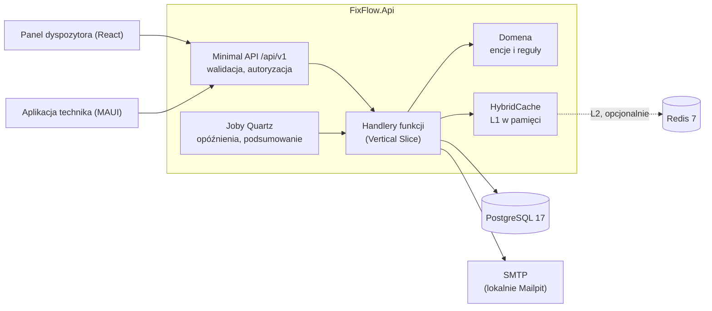

# FixFlow.Api

[](https://github.com/mpalus-git/FixFlow.Api/actions/workflows/ci.yml)
[](LICENSE)

## Opis systemu

FixFlow to backend systemu obsługi zleceń serwisowych w terenie dla firmy naprawiającej klimatyzację i urządzenia biurowe. Dyspozytor prowadzi kartotekę klientów, urządzeń i części, tworzy zlecenia i przypisuje je technikom. Technik realizuje zlecenie w terenie: rozpoczyna pracę, dodaje wpisy serwisowe z czasem pracy, zdjęciami i zużytymi częściami, a na końcu zamyka zlecenie i pobiera protokół serwisowy w PDF. Repozytorium zawiera wyłącznie API; klienci (panel webowy React i aplikacja mobilna MAUI) korzystają z kontraktu opisanego w [openapi/v1.json](openapi/v1.json).

Działająca instancja: [fixflow-api-us2p.onrender.com/scalar](https://fixflow-api-us2p.onrender.com/scalar). Usługa działa na darmowym planie Render, więc pierwsze wejście po okresie bezczynności może trwać do minuty. Konta demonstracyjne:

| Rola | E-mail | Hasło |
|---|---|---|
| Dispatcher | `dispatcher@fixflow.local` | `cyTfum-duwcyr-kyjky3` |
| Technician | `technician@fixflow.local` | `fembag-wupker-Retfi7` |

Token otrzymany z `POST /api/v1/auth/login` wkleja się w Scalar jako `Bearer`.

## Architektura



Każda funkcja ma własny folder w `src/FixFlow.Api/Features/<Obszar>/<Funkcja>/` z endpointem, handlerem, walidatorem oraz rekordami żądania i odpowiedzi. Reguły biznesowe są w encjach w `Domain/`, a elementy wspólne (persystencja, autoryzacja, mapowanie błędów, cache, e-mail, joby) w `Common/`.

## Uruchomienie lokalne

Wymagany jest Docker. Całe środowisko (API, PostgreSQL, Redis, Mailpit) startuje jedną komendą:

```bash
cp .env.example .env
docker compose up --build
```

Przed startem trzeba uzupełnić w `.env`:

| Zmienna | Wartość |
|---|---|
| `POSTGRES_PASSWORD` | dowolne hasło lokalnej bazy |
| `JWT_SIGNING_KEY` | losowy klucz, co najmniej 32 bajty, np. wynik `openssl rand -base64 48` |
| `DEMO_ADMIN_PASSWORD`, `DEMO_DISPATCHER_PASSWORD`, `DEMO_TECHNICIAN_PASSWORD` | hasła kont demo: co najmniej 8 znaków, mała i wielka litera, cyfra, znak specjalny |

Po starcie dostępne są:

| Adres | Co |
|---|---|
| http://localhost:8080/scalar | dokumentacja i klient API |
| http://localhost:8080/openapi/v1.json | dokument OpenAPI |
| http://localhost:8080/health | liveness (bez bazy) |
| http://localhost:8080/health/ready | readiness (z bazą) |
| http://localhost:8025 | Mailpit, podgląd wysłanych e-maili |

Migracje bazy wykonują się przy starcie aplikacji. Konta demo (`admin@fixflow.local`, `dispatcher@fixflow.local`, `technician@fixflow.local`) zakładane są z hasłami z `.env`.

Testy wymagają .NET SDK 10 i działającego Dockera (testy integracyjne uruchamiają PostgreSQL i Redis przez Testcontainers):

```bash
dotnet test
```

## Konfiguracja

Ustawienia można podać w `appsettings.json` lub jako zmienne środowiskowe (separator `__`, np. `Jwt__SigningKey`).

| Klucz | Opis | Domyślnie |
|---|---|---|
| `ConnectionStrings__Database` | connection string PostgreSQL (Npgsql) | brak, wymagany |
| `ConnectionStrings__Redis` | connection string Redis; pusty oznacza cache tylko w pamięci | pusty |
| `Jwt__SigningKey` | klucz podpisu tokenów, co najmniej 32 bajty | brak, wymagany |
| `Jwt__AccessTokenLifetime` / `Jwt__RefreshTokenLifetime` | czas życia tokenów | `00:15:00` / `7.00:00:00` |
| `Cors__AllowedOrigins__0` | dozwolone originy klientów przeglądarkowych (kolejne pod `__1`, `__2`) | brak |
| `RateLimiting__Auth__PermitLimit` / `RateLimiting__Auth__Window` | limit logowania i odświeżania tokena na adres IP | `10` / `00:01:00` |
| `Seed__DemoUsers__Enabled` | zakładanie kont demo przy starcie | `false` |
| `Seed__DemoUsers__AdminPassword`, `...DispatcherPassword`, `...TechnicianPassword` | hasła kont demo, wymagane przy włączonym seedzie | brak |
| `Email__Enabled` | wysyłka e-mail; wyłączona oznacza tylko wpis w logu | `false` |
| `Email__Host`, `Email__Port`, `Email__Security` | serwer SMTP; `Security` przyjmuje `None`, `Auto`, `SslOnConnect`, `StartTls` | brak, `587`, `Auto` |
| `Email__Username`, `Email__Password` | dane logowania SMTP, opcjonalne | brak |
| `Email__FromAddress`, `Email__FromName` | nadawca wiadomości | `noreply@fixflow.local`, `FixFlow` |
| `Jobs__Enabled` | uruchamianie jobów Quartz | `true` |
| `ASPNETCORE_FORWARDEDHEADERS_ENABLED` | odczyt `X-Forwarded-For` i `X-Forwarded-Proto` za reverse proxy | `false` |
| `ForwardedHeaders__ForwardLimit` | liczba zaufanych proxy w łańcuchu `X-Forwarded-For` | `1` |
